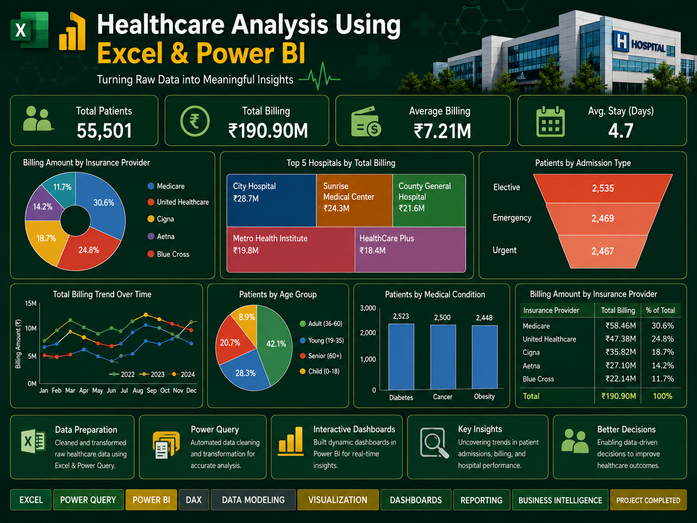

  

 

  
  
  
  
  
  

  
  
  
  
  

 

---

---

## 🔍 Project Overview

This project analyzes healthcare data from 2022 to 2024 to identify key trends in patient admissions, hospital performance, medical conditions, and billing.

The analysis includes data cleaning, transformation, and modeling to uncover actionable insights. Interactive dashboards are developed to support data-driven decision-making and improve operational efficiency.

---

## 🎯 Objectives

- Analyze healthcare data from 2022 to 2024 to identify trends and patterns  
- Analyze patient admission trends and hospital performance  
- Identify patterns in medical conditions and treatments  
- Evaluate billing and financial performance  
- Assess the impact of admission types and insurance providers  
- Provide insights for cost optimization and resource utilization  

---

## 🛠️ Tools & Technologies

- 📊 Microsoft Excel  
- 🔄 Power Query  
- 📈 Power BI (Data Modeling & Visualization)  
- 📊 Data Visualization  
- 📉 Dashboard Development  

---

## 📁 Dataset

The dataset includes:

- Patient Data  
- Admission Data  
- Hospital Data  
- Billing & Financial Data  

---

## ⚙️ Process

1. Data Cleaning using Power Query  
2. Data Transformation and Modeling  
3. Exploratory Data Analysis (EDA)  
4. Dashboard Creation  

---

## 📊 Key Insights

- Identified trends in patient admissions across years  
- Analyzed cost variations based on insurance providers  
- Highlighted high-cost medical conditions  
- Evaluated hospital performance and resource utilization  

---

## 📷 Dashboard Preview

### 🧑‍⚕️ Patient & Admission Analysis

---

### 💰 Billing & Financial Analysis

---

## 📈 Results

This project provides valuable insights into healthcare trends, cost drivers, and operational efficiency, helping stakeholders make informed decisions.

---

## 🚀 Future Improvements

- Build advanced dashboards using Power BI  
- Integrate real-time healthcare data  
- Apply predictive analytics for patient outcomes  

---

## 📬 Contact

Feel free to connect with me for feedback or collaboration!
